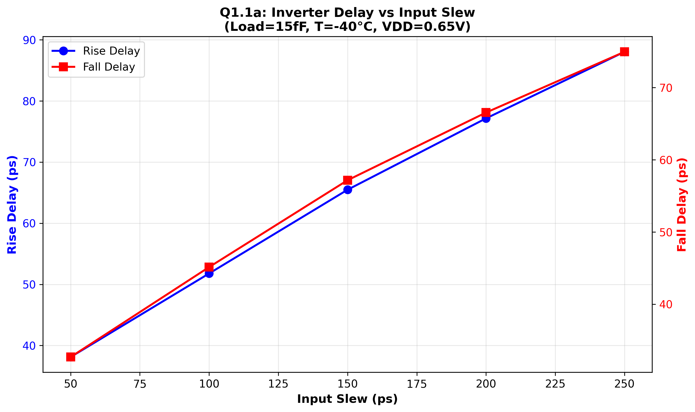
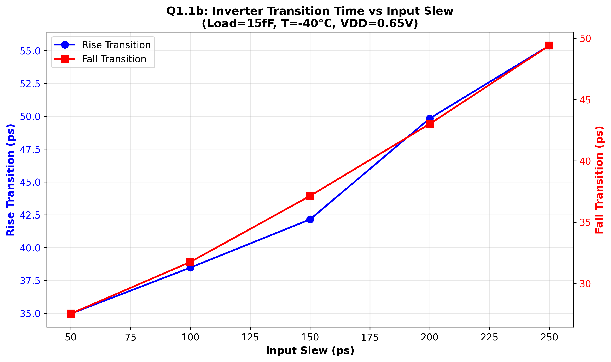
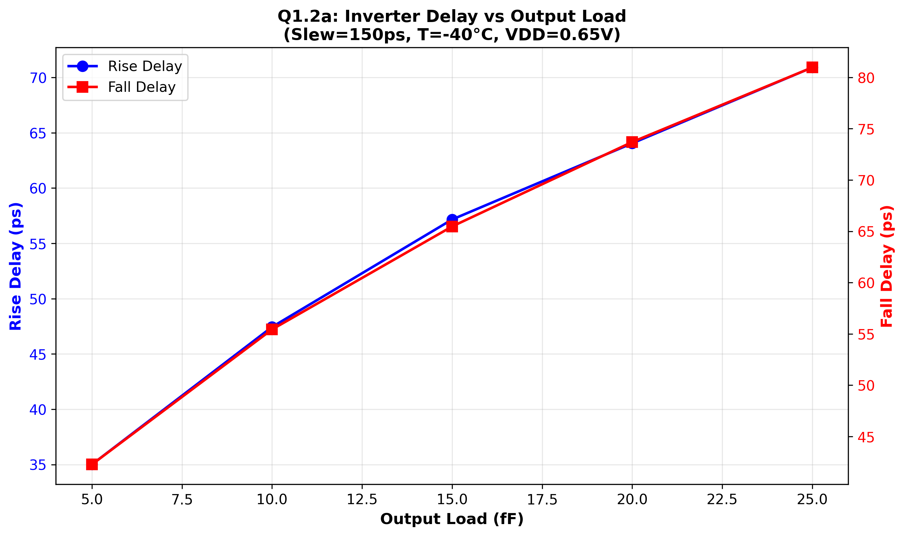
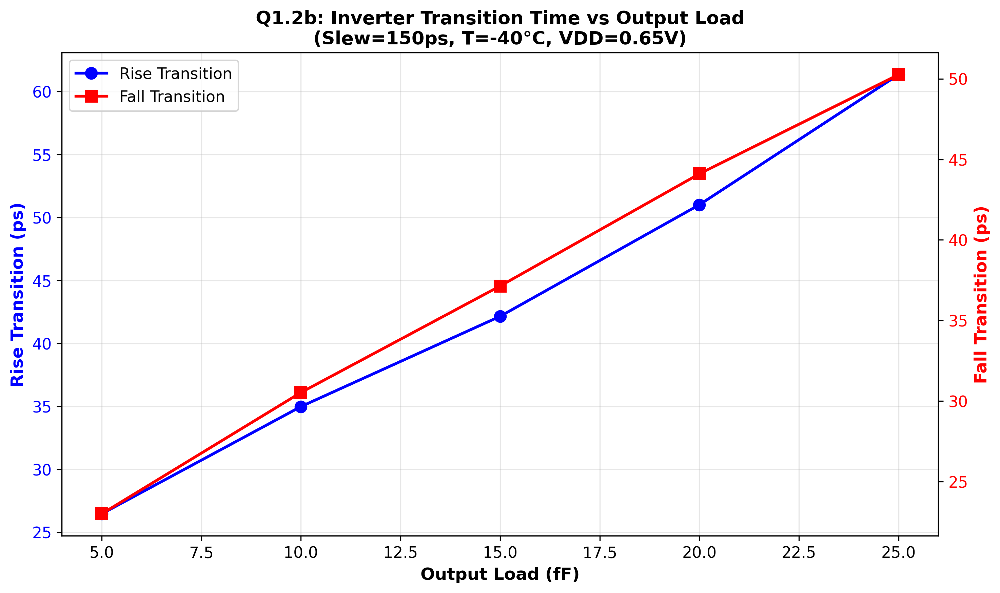

# Q1.1

Delay Vs Slew 
Raw Data (from .mt* files):
---------------------------
File  | Slew  | fall_delay    | rise_delay    | rise_tr       | fall_fr
------|-------|---------------|---------------|---------------|---------------
mt0   | 50ps  | 3.268e-11 s   | 3.812e-11 s   | 3.497e-11 s   | 2.754e-11 s
mt1   | 100ps | 4.513e-11 s   | 5.178e-11 s   | 3.848e-11 s   | 3.176e-11 s
mt2   | 150ps | 5.716e-11 s   | 6.547e-11 s   | 4.215e-11 s   | 3.714e-11 s
mt3   | 200ps | 6.653e-11 s   | 7.714e-11 s   | 4.984e-11 s   | 4.301e-11 s
mt4   | 250ps | 7.494e-11 s   | 8.802e-11 s   | 5.539e-11 s   | 4.940e-11 s

Input Slew (ps) | Rise Delay (ps) | Fall Delay (ps) | Rise Trans (ps) | Fall Trans (ps)
----------------|-----------------|-----------------|-----------------|------------------
      50        |     38.12       |     32.68       |     34.97       |     27.54
     100        |     51.78       |     45.13       |     38.48       |     31.76
     150        |     65.47       |     57.16       |     42.15       |     37.14
     200        |     77.14       |     66.53       |     49.84       |     43.01
     250        |     88.02       |     74.94       |     55.39       |     49.40

## Transition vs Slew

# Q1.2 

Delay vs. Load
-----------------
Raw Data (from .mt* files):
---------------------------
File  | Load  | rise_delay    | fall_delay    | rise_tr       | fall_fr
------|-------|---------------|---------------|---------------|---------------
mt0   | 15fF  | 5.716e-11 s   | 6.547e-11 s   | 4.215e-11 s   | 3.714e-11 s
mt1   | 5fF   | 3.501e-11 s   | 4.227e-11 s   | 2.646e-11 s   | 2.300e-11 s
mt2   | 10fF  | 4.744e-11 s   | 5.543e-11 s   | 3.498e-11 s   | 3.053e-11 s
mt3   | 20fF  | 6.405e-11 s   | 7.370e-11 s   | 5.101e-11 s   | 4.410e-11 s
mt4   | 25fF  | 7.091e-11 s   | 8.097e-11 s   | 6.135e-11 s   | 5.026e-11 s

Output Load (fF) | Rise Delay (ps) | Fall Delay (ps) | Rise Trans (ps) | Fall Trans (ps)
-----------------|-----------------|-----------------|-----------------|------------------
       5         |     35.01       |     42.27       |     26.46       |     23.00
      10         |     47.44       |     55.43       |     34.98       |     30.53
      15         |     57.16       |     65.47       |     42.15       |     37.14
      20         |     64.05       |     73.70       |     51.01       |     44.10
      25         |     70.91       |     80.97       |     61.35       |     50.26

## Transition vs. Load

# Q2 

## Q2.1: Is both rise & fall delay increasing with rising of output load  & input slew? (10 points)

ANSWER: YES, both rise and fall delays increase with rising output load AND 
        rising input slew.

## Q2.2:  Is timing arc from input pin to outpin of inverter is inverting arc, non-inverting arc or nonunate? 

The timing arc from input to output of an inverter is an INVERTING ARC 
(negative_unate) because the output always transitions in the opposite 
direction to the input.

# Q2.3 

 	nom_voltage : 0.750000;
 	nom_temperature : -40.000000;
 	nom_process : 0.99;

# Q2.4

MACRO TNBUFFX2_RVT

  SIZE 2.128 BY 1.672 ;

The layers are 
M1 (Metal1)
C0 (Contact)
NWELL N-Well layer for PMOS regions
and 
P0 (Polysilicon)

The power signals are VDD and VSS 

OBS is Obstruction

OBS defines regions inside of a cell where routing is blocked.

It prevents the PNR tool from routing over this.
It's to prevent Design Rule Violations
